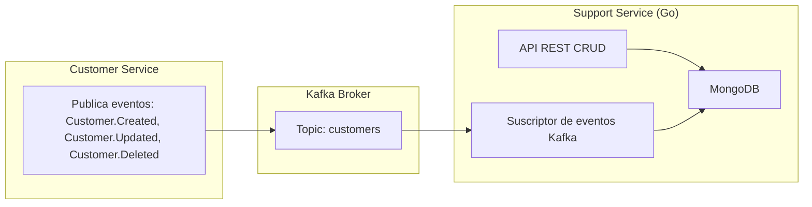

# TelecomX - Support Service

Este microservicio forma parte del ecosistema **TelecomX**, una arquitectura orientada a eventos basada en el patrón **Broker Messaging**.  
Su función principal es manejar los tickets de soporte a partir de los eventos generados en el sistema central de clientes.

---

## 🧩 Descripción General

El **Support Service** escucha los eventos publicados en el tópico `customers` de **Kafka** y realiza operaciones sobre una base de datos **MongoDB**.  
Además, expone un conjunto de endpoints REST para consultar y administrar la información de los usuarios con soportes.

---

## ⚙️ Arquitectura



## API

````http request
### Crear una portabilidad
POST  http://localhost:8080/support HTTP/1.1
content-type: application/json
{
    "userId": "123456789",
	"issue": "My phone is not working",
	"status": "Pending"
}

### Consultar portabilidades
GET http://localhost:8080/support HTTP/1.1
###
````